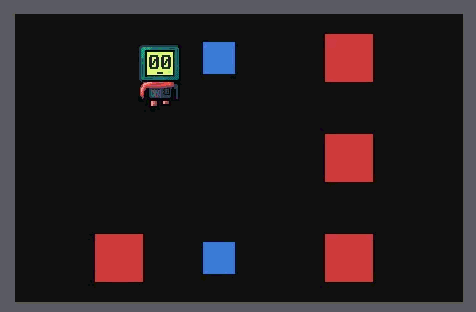

# bones

A small native engine core — windows, tray icon, input (SDL), logging, and a
message bus — with all product behavior implemented as WASM extensions in
any language. See [docs/architecture.md](docs/architecture.md) for the full
design.

**Status:** the kernel, renderer, egui UI, audio, game-core, optional wry web
panels, hot reload, orderly shutdown, extension flow-control budgets, and
custom native-module injection (`.module(...)`, see `embedding-demo/`) all
work today.

Use cases:

- A game engine with quick prototyping: implement a game module, ship
  levels as easily reloadable WASM extensions.
- A GUI application: implement a UI module, write the app's logic as
  extensions.

## Quickstart

```sh
pwsh dist.ps1
```

Builds the engine and every extension into `dist/` — run `dist/bones(.exe)`
directly. Or, without a self-contained build:

```sh
cargo run -p app
```

Drop a built `.wasm` extension into `extensions/` next to wherever you run
it (see `extensions/hello/README.md` to build the reference extension).

For the complete web-panel example:

```sh
pwsh extensions/dashboard/build.ps1
```

Run `extensions/dashboard/dist/bones(.exe)` to see two WASM components
exchange pushed metrics and direct history requests through an embedded page.

## Documentation

Start at [docs/index.md](docs/index.md) — map of the architecture,
detailed designs, decisions (ADRs), and worked examples.

## AI agents

The base agent policy — flows, roles, and skills — lives in
[an-dr/agents](https://github.com/an-dr/agents). Install it globally for your
AI tools; [AGENTS.md](AGENTS.md) holds the repo-specific rules that extend it.

## Demos

Game:


