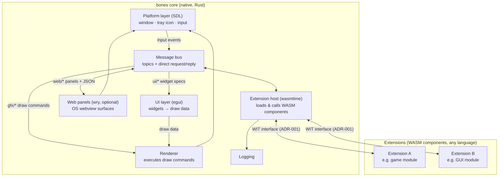
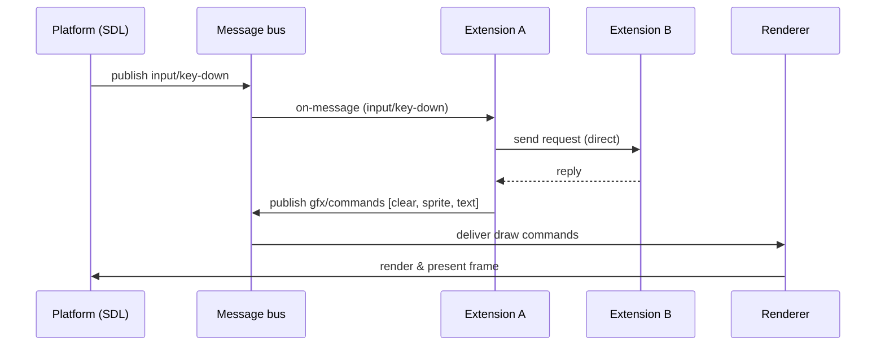
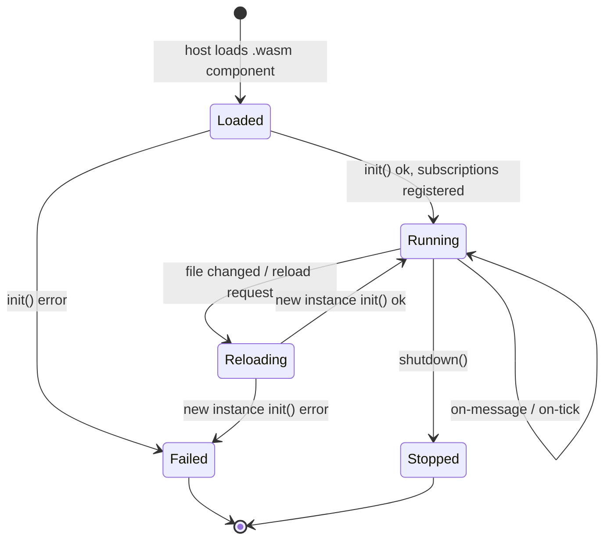
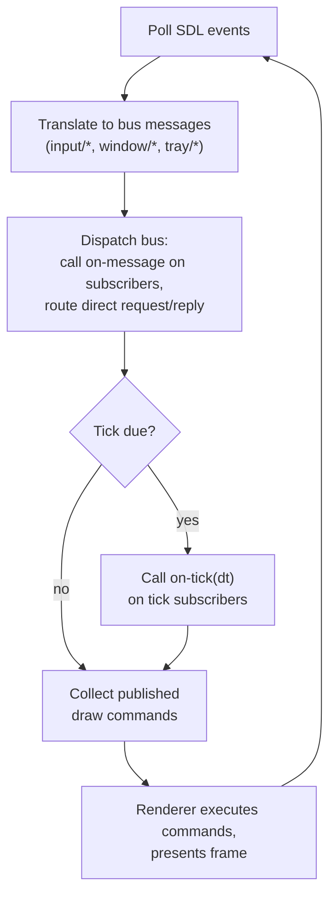

# bones — engine architecture

bones is a universal extendable engine: a small native core that owns the platform (windows, tray icon, input via SDL), logging, rendering, and a message bus. All product behavior — game logic, GUI applications, tools — lives in extensions: WASM components written in any language, exchanging messages through the core.

The core itself is two tiers ([ADR-011](adr/ADR-011-native-core-modules.md)): a fixed **kernel** (bus, wasm-extensions, contract, platform, logging, runner) and swappable **native modules** — renderer, UI layer, web panels. Most projects use the shipped engine app as-is and write only extensions; projects with native needs embed bones as a library, own the composition root, and inject their own modules. On the bus, modules are indistinguishable from extensions. See [design/modules.md](design/modules.md).

Decisions behind this design are recorded in [adr/](adr/).

## System overview

- **Platform layer** — the only component touching the OS: window management, tray icon, input devices, timers. Everything it observes is translated into bus messages.
- **Renderer** — owns all drawing (ADR-002). Extensions never render directly; they publish draw commands and the renderer executes them against the SDL window each frame.
- **UI layer** — egui embedded in the core (ADR-005). Extensions declare widgets on `ui/*` topics; egui turns them into draw data for the renderer and interaction events flow back over the bus.
- **Web panels** — optional wry-based OS webviews (ADR-006). Extensions manage panels and exchange JSON with their web frontends over `web/*` topics; feature-flagged so minimal builds carry no webview dependency. A detachable presentation may attach to a live headless engine and release its native window completely when closed (ADR-028). The `dashboard` and `metrics` example components demonstrate pushed data, synchronous pull requests, and page IPC end to end.
- **Message bus** — the single communication fabric (ADR-003). Pub/sub topics for broadcast-style flows (input, tick, draw commands) plus direct request/reply between named endpoints when a response is required.
- **Extension host** — embeds wasmtime, instantiates extensions as WASM components, dispatches bus messages into their exported handlers, and exposes the host API (publish, send, subscribe, log) as imports.
- **Logging** — core-owned sink; extensions log through a host import so all output lands in one structured stream tagged by extension.

## Presentation backends

ADR-002's principle — *the engine presents, extensions send commands* — is applied at three abstraction levels. An extension picks the level that fits its needs; all three coexist in one window system, and none leaks toolkit details across the WASM boundary.

| Topic prefix | Backend | Meant for |
| --- | --- | --- |
| `gfx/*` | SDL renderer (ADR-002) | games, custom drawing |
| `ui/*` | egui widget layer (ADR-005) | tool-style widget UI |
| `web/*` | wry OS webview (ADR-006, optional) | rich / web-technology UI |

## Message flow

One frame of a typical interactive extension — input in, draw commands out, plus a direct request/reply between two extensions:

Messages carry a **topic, a sender id, and a payload**. Core-defined messages (input, tick, draw commands) are typed WIT values; extension-to-extension payloads are opaque bytes whose schema the participating extensions agree on. This keeps the core schema-free while the platform API stays strongly typed.

## Extension lifecycle

Because extensions are isolated components reached only through the bus, **hot reload** is a lifecycle transition, not a special mechanism: the host drops the old instance, instantiates the new binary, and re-registers its subscriptions. Other extensions notice nothing except a possible pause in replies. This is what makes the "easily reloadable game level" use case cheap.

## Core event loop and extension execution

Extensions are **event-driven** (ADR-004): the core calls their exported handlers; they never own a thread or a loop. Extensions that need a frame loop subscribe to the `core/tick` topic and receive `on-tick(dt)` callbacks; GUI-style extensions simply stay idle between messages.

These loop steps are the named **frame phases** native modules hook (`input → dispatch → tick → render → present`, ADR-011): the renderer module owns `render`/`present`, and a headless build simply leaves them empty.

## Extension interface (sketch)

The contract is a WIT world (exact signatures are an implementation-increment concern):

- **Extension exports:** `init(config)`, `shutdown()`, `on-message(msg)`, `on-tick(dt)`.
- **Host imports:** `subscribe(topic)`, `publish(topic, payload)`, `send(endpoint, payload) -> reply`, `log(level, text)`.

## Repository shape (target)

See [structure.md](structure.md) for the component inventory, dependency rules, and source layout.

## Out of scope for this design

- Exact WIT signatures and the full draw-command, widget, and web-panel message vocabularies.
- GPU-level access or custom shaders for extensions (escape hatches like pixel buffers can be added by a future ADR if a use case demands it).
- Multi-window management, audio, networking — later design rounds.
