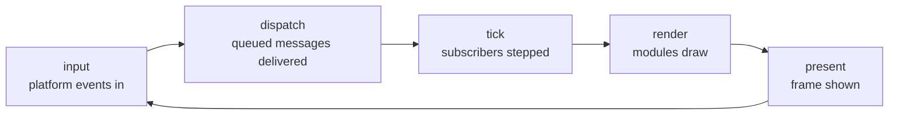

# Messaging and execution

One bus carries everything, and one loop drives everything. Together they decide what a part of bones can assume about the rest — which is why they are architecture rather than implementation.

## One fabric, two shapes

Every part addresses every other part the same way, whether it is a kernel component, a native module, or a sandboxed extension. There is no side channel, no direct call between extensions, and no privileged path a module has and an extension lacks.

The bus offers two shapes, because two genuinely different needs exist ([ADR-003](../adr/ADR-003-hybrid-messaging.md)):

- **Publish/subscribe** for facts with no single recipient — input, ticks, lifecycle changes, draw commands. The publisher does not know or care who listens, and adding a listener changes nothing for it.
- **Direct request/reply** for questions that need an answer — reading a saved state, asking a module for a capability. Addressed to a name, and always resolved: a reply, or an error reply if the target faulted, is unknown, or the call would form a cycle. No request ends in silence ([ADR-010](../adr/ADR-010-synchronous-send.md)).

Topics are hierarchical and their prefixes divide by ownership: `input/*`, `window/*`, `core/*` flow outward from the engine; `gfx/*` and `audio/*` flow inward to modules; `ui/*` and `web/*` go both ways; everything else belongs to extensions and the engine never inspects it. The full namespace and the encoding of each payload are in [design/messaging.md](../design/messaging.md) and [wit/wire-format.md](../../wit/wire-format.md).

**The core stays schema-free where it can.** Messages the engine defines are typed, so the platform API is checked rather than conventional ([ADR-016](../adr/ADR-016-typed-core-messages.md)). Messages between extensions are opaque bytes whose meaning the participants agree on. This is what lets two extensions share a protocol the engine has never heard of.

## What the bus promises

Four guarantees, and each one exists because its absence would force every extension to defend itself.

| Guarantee | Meaning |
| --- | --- |
| **Ordering** | Per sender, per topic, messages arrive in the order sent. Nothing is promised across senders or topics ([ADR-009](../adr/ADR-009-delivery-semantics.md)). |
| **Delivery** | At most once. A message is dropped only toward a part that is not running. |
| **Serialization** | One part never has two handlers running at once, so no extension needs internal locking. |
| **Isolation** | A handler that overruns its time or message allowance is faulted, not waited for ([ADR-007](../adr/ADR-007-watchdog-quarantine.md)). |

The last one is the load-bearing promise: an extension is untrusted code in the frame path, and the engine must survive it being slow, stuck, or malicious. Budgets are per frame and cumulative counters record what was dropped, so a quarantine is diagnosable rather than mysterious.

**A handler never publishes directly onto the bus.** Publications made inside a handler are queued and delivered by the loop afterwards. This is not a workaround for a defect in the underlying primitive — it is permanent and mandatory, because reentrant delivery from inside a handler deadlocks unconditionally ([ADR-015](../adr/ADR-015-deferred-dispatch-remains-mandatory.md)).

## Cost shapes the boundary

Every message crossing the sandbox copies its payload, so cost scales with the *number* of messages far more than their size. Design boundaries around events and coarse transfers — a snapshot per frame, static data once at load — rather than fine-grained queries in a hot path. Synchronous request/reply makes per-frame queries possible; this is why they should stay rare.

## The frame

Extensions never own a thread or a loop. The runner owns the only loop, and calls into everything else in a fixed order ([ADR-004](../adr/ADR-004-event-driven-execution.md)):

The five phases are the extension points. A module hooks the phases it needs and ignores the rest; a headless build simply leaves the presentation phases empty, which is why it needs no separate code path. Two orderings matter and they are deliberately opposite: modules **render** in registration order, so the last composed draws on top, and are **offered input** in reverse, so the one drawn on top sees the event first ([ADR-031](../adr/ADR-031-native-modules-reach-each-other-only-through-services.md)).

Subscribing to the tick is how a part opts into a frame loop. A game subscribes and is stepped every frame; a tool-style extension does not, and stays idle until something addresses it. Nothing polls.

## Shutdown is a message first

A close request — from the window, the tray, or an extension asking to exit — is published as an event before anything is torn down, so parts get the chance to react and save. Only then are extensions stopped, modules shut down, and the platform released. A part that hangs while stopping is abandoned under the same budget that governs any other call: the engine always exits.

Phase-by-phase behaviour is in [design/platform.md](../design/platform.md); the module hooks are in [design/modules.md](../design/modules.md).
