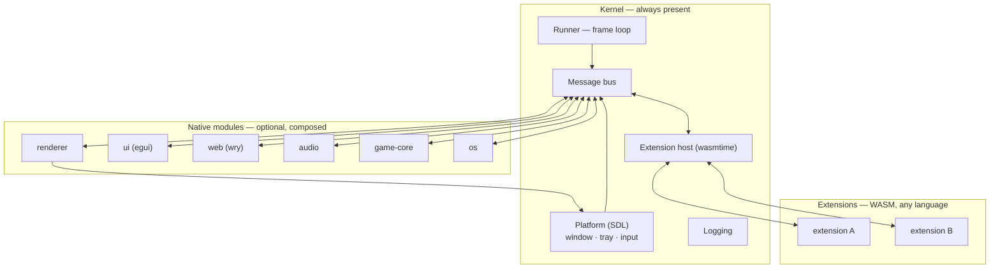

# System overview

bones is a small native core that owns the machine — window, tray, input, audio, rendering, and a message bus — with product behaviour supplied as WASM extensions in any language. The core presents; extensions describe what to present. That one boundary is what makes an extension sandboxed, hot-reloadable, and language-agnostic.

## Three kinds of part

Everything in a running engine is one of three things, and the difference is about trust and lifetime rather than about what a part does.

| | Kernel | Native module | Extension |
| --- | --- | --- | --- |
| Always present | yes | no | no |
| Written in | Rust, compiled in | Rust, compiled in | any language, loaded as `.wasm` |
| Trusted | yes | yes | no |
| Hot-reloadable | no | no | yes |
| Reaches the OS | yes | yes | never |

The **kernel** is what cannot be removed: the bus, extension hosting, the WIT contract, the platform layer, logging, and the frame loop. It names no module and runs with none registered — that is what makes a headless build possible ([ADR-011](../adr/ADR-011-native-core-modules.md), [ADR-014](../adr/ADR-014-headless-runner-skeleton.md)).

**Native modules** are optional and composed by whoever builds the binary. A module owns a native resource — a GPU surface, an egui context, a webview, an audio device — or runs a simulation the engine steps each frame. Modules reach each other only through typed services, never by naming each other's crates ([ADR-031](../adr/ADR-031-native-modules-reach-each-other-only-through-services.md)).

**Extensions** are WASM components the engine loads at runtime. An extension cannot touch the OS, cannot render, and cannot link a native library; it publishes messages and the engine acts. Everything it is allowed to do is in the contract ([ADR-001](../adr/ADR-001-wasm-component-model.md)).

On the bus these three are indistinguishable. A module and an extension both register a name, both receive messages, both may answer a direct request. Whether `game-core` is native or WASM is a build decision no other part can observe — which is why a capability can move between tiers without a protocol change.

## The shipped modules

Six modules ship first-party. An embedder may replace any of them or add their own.

- **renderer** — owns all drawing. Extensions never draw; they publish batches of draw commands and the renderer executes them against the window ([ADR-002](../adr/ADR-002-engine-owned-rendering.md)).
- **ui** — egui embedded in the core. Extensions declare widgets; the layer turns them into draw data and sends interaction events back ([ADR-005](../adr/ADR-005-egui-ui-layer.md)).
- **web** — wry OS webviews for rich or web-technology UI, exchanging JSON with their pages. A presentation may also attach to a live headless engine and release its window when closed ([ADR-006](../adr/ADR-006-wry-web-panels.md), [ADR-028](../adr/ADR-028-detachable-native-modules-and-wry-presentation.md)).
- **audio** — sound effects and music on `audio/*`.
- **game-core** — a 2D simulation: entities, collision, tilemaps, sprite animation. It publishes authoritative transform snapshots the presentation draws ([ADR-019](../adr/ADR-019-2d-game-core-module-native-bought-dependencies.md), [ADR-026](../adr/ADR-026-game-core-publishes-authoritative-entity-transform-snapshots.md)).
- **os** — the desktop capabilities the sandbox denies a guest: clipboard, browser, native file dialogs, HTTPS fetch. Each request runs off the frame thread, so a dialog waiting on a user cannot stall the engine.

Two levels of optional apply, and they are independent. A module is **compiled in** by a cargo feature, and then **registered** by whoever composes the binary. The engine executable compiles audio and game-core by default but registers them only when its configuration asks for one; web and os are not even compiled unless their feature is on. A module that is compiled in but never registered costs nothing at runtime.

Implementation detail for each module lives in its crate README; the module system itself is in [design/modules.md](../design/modules.md).

## Three ways to present

[ADR-002](../adr/ADR-002-engine-owned-rendering.md)'s principle — the engine presents, extensions send commands — is offered at three levels. They coexist in one window, and an extension picks per need rather than once: a game on `gfx/*` may put its settings dialog on `ui/*`.

| Level | Backend | Suits |
| --- | --- | --- |
| `gfx/*` | SDL renderer | games, custom drawing |
| `ui/*` | egui widgets | tools, inspectors, settings |
| `web/*` | wry webview | rich or web-technology UI |

None of them leaks toolkit types across the sandbox boundary. An extension names shapes, widgets, or JSON — never an egui or SDL object. That is what lets the backend behind a level change without touching a single extension. Routing between the levels, and how input finds the right one, is in [design/presentation.md](../design/presentation.md).

## Two public surfaces

bones is consumed two ways, and they version independently because their audiences are different ([ADR-029](../adr/ADR-029-the-two-version-lines-are-the-two-public-surfaces.md)).

| Surface | Is | Pinned by | Moves when |
| --- | --- | --- | --- |
| **engine** | the Rust API of `bones-engine` | an embedder | the library surface changes |
| **ABI** | `bones:extension` plus the wire format | an extension author, in any language | the guest contract changes |

The split exists because a `.wasm` file outlives the engine build that loaded it and need not be written in Rust. One number cannot promise both audiences: a renderer fix must not invalidate every extension, and a contract break must stay visible even when no Rust API moved.

The ABI is enforced structurally, not by semver range — a guest built against a different version of the contract is refused at instantiation, and so is one whose shape differs without a version change. What that costs and how to avoid paying it is in [wit/README.md](../../wit/README.md); the payload encoding, specified for every language rather than only Rust, is in [wit/wire-format.md](../../wit/wire-format.md).

## What an extension gets

The contract is small on purpose. An extension exports lifecycle and message handlers and imports a handful of host calls — publish, send, subscribe, log, and the capabilities a module grants over the bus. It owns no thread and no loop: the engine calls it ([ADR-004](../adr/ADR-004-event-driven-execution.md)).

Because an extension is reached only through the bus, **hot reload is a lifecycle transition rather than a mechanism**. The host drops the instance, loads the new binary, and re-registers subscriptions; other parts observe nothing but a pause. The same isolation makes a misbehaving extension survivable — it is faulted and quarantined while everything else continues ([ADR-007](../adr/ADR-007-watchdog-quarantine.md)).

The exact contract is [design/extensions.md](../design/extensions.md) and the WIT package itself.
