# Extensions and the extension host

Detailed design of the extension model. Decisions: [ADR-001](../adr/ADR-001-wasm-component-model.md) (Component Model ABI), [ADR-004](../adr/ADR-004-event-driven-execution.md) (event-driven execution), [ADR-007](../adr/ADR-007-watchdog-quarantine.md) (watchdog and quarantine).

## What an extension is

A WASM **component** implementing the engine's WIT world. Its **name** (bus
endpoint id) is derived from its filename today — no manifest or version yet;
one may arrive via a future ADR if the need appears. The name must be unique
per engine instance; the host rejects a duplicate at load.

The contract, at concept level:

- **Extension exports:** `init()`, `shutdown()`, `on-message(msg)`,
  `on-tick(dt)`.
- **Host imports:** `subscribe(topic)`, `publish(topic, payload)`,
  `send(endpoint, payload) → reply`, `log(level, text)`.

Exact signatures live in the WIT package (`wit/`) once implementation starts;
this document intentionally stays above them.

## Execution model

Extensions never own a thread or loop. The host calls their exports:

- `on-message` for every delivered bus message and direct request.
- `on-tick(dt)` each frame — only for extensions subscribed to `core/tick`.
- `shutdown()` once before an orderly runtime unload or reload.
- Handler calls for one extension never overlap: `on-message` and `on-tick`
  are serialized per extension, so extension authors need no internal locking.

Every call runs under the ADR-007 time budget.

## Lifecycle

Refines the state diagram in [architecture.md](../architecture.md) with the
Faulted state:

```mermaid
stateDiagram-v2
    [*] --> Loaded: component loaded, manifest checked
    Loaded --> Running: init() ok, subscriptions registered
    Loaded --> Faulted: init() error
    Running --> Running: on-message / on-tick
    Running --> Faulted: budget violation or trap (ADR-007)
    Running --> Reloading: file changed / reload request
    Faulted --> Reloading: explicit reload (user or host policy)
    Reloading --> Running: new instance init() ok
    Reloading --> Running: replacement init() error; old instance retained
    Reloading --> Faulted: new instance init() error
    Running --> Stopped: shutdown()
    Stopped --> [*]
```

Every transition is published on `core/lifecycle`, so tooling and other
extensions can observe loads, faults, and reloads.

## Runtime activation

`extensions_dir` is scanned recursively into a catalog. Directory names
organize distributions but extension identity remains the globally unique file
stem. Embedders either retain load-all startup behavior or provide a startup
allow-list; other catalog entries remain uninstantiated.

The embedder may authorize one host-stamped extension sender as the runtime
controller. Its typed `core/extensions/load`, `unload`, or `reload` commands
are applied after bus dispatch; commands from every other sender are rejected
and logged. State changes appear on `core/lifecycle`. A reload attaches its
replacement before shutting down the current instance; a failed replacement is
logged and leaves the current instance running. Unload calls `shutdown`,
preserves messages the hook published for later dispatch, then releases the bus
endpoint, direct-send registration, and component instance.

## Faults and quarantine

Per ADR-007: exceeding the per-call time budget, exhausting queue/publish
budgets, or trapping moves the extension to Faulted — instance dropped,
subscriptions released, lifecycle event published. Reload is explicit, never
an automatic retry loop.

## Hot reload

Reload = call `shutdown`, drop the old instance, instantiate the new binary,
run `init`, and re-register subscriptions. Two consequences extension authors
must know:

- **In-memory state does not survive reload.** Persistence is the extension's
  own concern (e.g. writing state out on `shutdown` or on demand). A state
  hand-off mechanism, if ever needed, is a future ADR.
- Messages published toward the extension during the gap are dropped
  (at-most-once, ADR-009); senders relying on a reply get an error reply.
