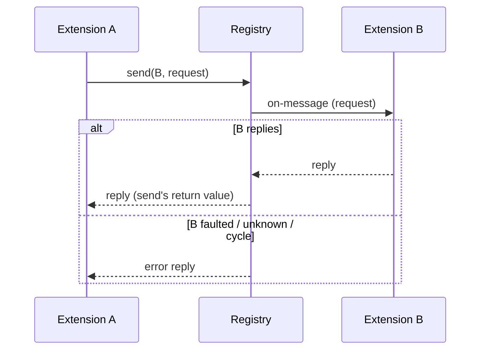

# Messaging

Detailed design of the message bus. Decisions: [ADR-003](../adr/ADR-003-hybrid-messaging.md) (hybrid topology), [ADR-009](../adr/ADR-009-delivery-semantics.md) (delivery semantics), [ADR-010](../adr/ADR-010-synchronous-send.md) (synchronous send).

## Message envelope

Every message carries:

| Field       | Meaning                                                            |
| ----------- | ------------------------------------------------------------------ |
| topic       | Hierarchical name (`input/key-down`); absent on direct messages    |
| sender      | Endpoint id of the publisher (extension name or core component)    |
| payload     | Typed value for core-defined messages; opaque bytes for app-defined |

Core-defined payloads (input, tick, lifecycle, draw commands, widgets, web
panel messages) are strongly typed in the extension contract. Extension-to-
extension payloads are opaque bytes whose schema the participants agree on —
the core never inspects them.

## Topic namespace

| Prefix           | Direction        | Content                                        |
| ---------------- | ---------------- | ---------------------------------------------- |
| `input/*`      | core → ext      | Keyboard, mouse, controller events (post-focus, see [ADR-008](../adr/ADR-008-layered-input-focus.md)) |
| `window/*`     | core → ext      | Window events: resize, close request, DPI      |
| `tray/*`       | core → ext      | Tray icon events: click, menu selection        |
| `core/tick`    | core → ext      | Frame tick with delta time (subscription = opt-in to a frame loop) |
| `core/lifecycle` | core → ext    | Extension state changes: loaded, faulted, reloaded |
| `renderer/*`   | core → ext    | Physical display changes and the fixed logical canvas |
| `gfx/*`        | ext → core      | Draw commands for the renderer                 |
| `ui/*`         | both             | Widget specs in, interaction events out        |
| `web/*`        | both             | Panel lifecycle in, JSON frontend messages both ways |
| everything else  | ext ↔ ext       | Application-defined topics                     |

## Pub/sub

- Subscription is by exact topic or prefix wildcard (`input/*`).
- Subscriptions are registered during extension init and released automatically
  on unload/fault — no dangling subscribers.
- Publishing is fire-and-forget for the sender.

## Direct request/reply

- Addressed to an **endpoint** (an extension's registered name, or a core
  service).
- The outcome is always one of: a reply, or an error reply (target faulted,
  unknown, or a call cycle). No request ends in silence.
- **Synchronous** (ADR-010): the caller blocks and the reply is the return
  value of `send`. The target's handler runs as soon as its per-extension
  serialization allows and under its own time budget. Call cycles (A→B→A)
  fail immediately with an error reply.

## Boundary pattern: chunky, not chatty

Every message crossing the bus copies its payload twice (components do not
share memory), so the cost scales with message *count* more than size. Design
extension boundaries around events and coarse data transfers — publish a
snapshot or event stream per frame, send static data once at load — rather
than fine-grained queries on hot paths. Synchronous send (ADR-010) makes
per-frame queries *possible*; this pattern is why they should stay rare.

## Guarantees and limits

- **Ordering:** per-sender FIFO per topic; nothing promised across senders or
  topics (ADR-009).
- **Delivery:** at-most-once; drops happen only toward non-Running extensions
  (ADR-009).
- **Flow control:** every extension has per-frame inbound and publish
  allowances in addition to the per-call time budget (ADR-007). Matching
  deliveries and guest publishes over those limits are dropped and counted;
  any violation faults and quarantines the extension while peers continue.
  Allowances reset at the runner frame boundary; counters remain cumulative.
