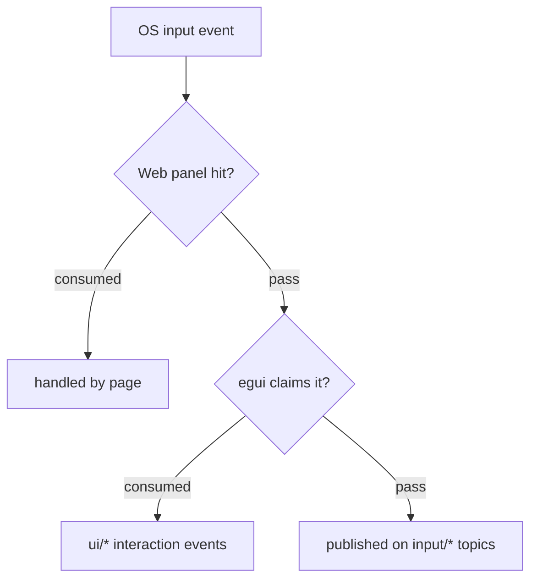

# Presentation

Detailed design of the three presentation backends and input routing.
Decisions: [ADR-002](../adr/ADR-002-engine-owned-rendering.md) (engine-owned rendering), [ADR-005](../adr/ADR-005-egui-ui-layer.md) (egui layer), [ADR-006](../adr/ADR-006-wry-web-panels.md) (web panels), [ADR-008](../adr/ADR-008-layered-input-focus.md) (layered focus).

## The three backends

| Topic prefix | Backend           | Extension sends            | Extension receives      |
| ------------ | ----------------- | -------------------------- | ----------------------- |
| `gfx/*`    | SDL renderer      | draw-command batches       | (input via `input/*`) |
| `ui/*`     | egui widget layer | widget specs (per frame)   | interaction events      |
| `web/*`    | wry web panels    | panel lifecycle + JSON     | JSON from its frontend  |

One extension may use several backends at once (e.g. a game on `gfx/*` with a
settings dialog on `ui/*`).

## gfx — draw commands

- An extension publishes an ordered **batch** of draw commands per frame,
  tagged with a **layer** number. The renderer draws layers bottom-up, and
  within a layer, batches in arrival order (per-sender FIFO makes each
  extension's own stream deterministic).
- A batch fully replaces that extension's previous batch on the same layer —
  retained until replaced, so a paused extension keeps its last frame visible.
- `gfx/clear-draw-batch` publishes an explicit empty batch for its sender,
  removing only that sender's retained draws on the next render pass.
- `renderer/logical-canvas` announces the renderer's fixed coordinate space
  whenever an extension loads or reloads.
- A single world-to-screen camera transform (position + zoom) applies to
  every draw — one viewport for the whole scene, not per-extension or
  per-layer.
- The command vocabulary (clear, sprite, shapes, text, …) is a versioned core
  API; its exact set is an implementation-increment concern.
- WASM guests may use the optional `game-ui` shared crate for logical-canvas
  menu layout, selection, hit-testing, and owned `gfx/*` command generation.
  It is theme-free and adds no native backend or bus protocol (ADR-025).

## ui — widgets

- Immediate-mode: an extension subscribed to `core/tick` publishes its widget
  spec each frame it wants UI visible; no spec published = no UI drawn.
- Interaction events (`ui/clicked`, `ui/changed`, …) are published back to the
  owning extension only.
- The widget vocabulary starts small (a dozen core widgets) and is versioned
  like the draw-command set.
- egui output is drawn by the renderer above all gfx layers.

## web — panels

- Panel lifecycle: an extension directly sends typed open (with inline HTML
  or a URL), close, or navigate commands to the `web` endpoint; the core
  confirms via `web/*` events. A missing optional module is therefore an
  immediate `UnknownEndpoint`, not a silently ignored publish.
- Each panel belongs to exactly one extension and is closed automatically when
  its owner unloads. Panel ids are local to that owner. Events include both
  the host-derived owner and panel id because bus topics are broadcast.
- Messages between the extension and its page are opaque JSON, bridged
  between the bus and the page's script environment. The page cannot reach the
  bus directly — everything passes through (and is attributable to) the
  owning extension.
- Panels are OS webviews composited above the SDL content — child views where
  the platform supports it, separate top-level windows as fallback (ADR-006).

## Input routing

Per ADR-008, events traverse layers top-down; each layer consumes or passes:

Consequences:

- `input/*` subscribers see only what the upper layers let through — a game
  never receives the keystrokes typed into a settings dialog above it.
- No focus protocol exists on the bus; extensions that need "is my UI focused"
  information derive it from their own `ui/*` / `web/*` events.
