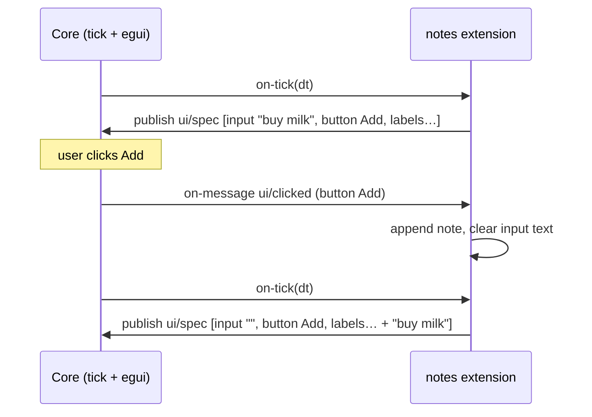

# Worked example: "notes" — an egui widget extension

A minimal note-taking tool: a window section with a text field, an *Add*
button, and the list of saved notes. Shows the `ui/*` backend end to end.
Code-agnostic — any language with Component Model support works the same way.

## Setup

1. Manifest: name `notes`, version `0.1.0`.
2. `init`: subscribe to `core/tick` (immediate-mode UI needs a frame pulse)
   and to `ui/*` events; load persisted notes if any.

## Steady state

Each `on-tick`, the extension publishes its widget spec: a panel containing a
text input (with its current text), an *Add* button, and one label per note.
Publishing every frame is the contract (ADR-005); the spec reflects whatever
the extension's state is *now*.

## One interaction

The extension never handles raw input: typing goes to egui (layered focus,
ADR-008), and the extension sees only semantic events (`ui/changed` with the
new field text, `ui/clicked`).

## Behavior under engine rules

- **Idle cost:** if the extension hides its UI (publishes no spec), it may
  also unsubscribe from `core/tick` and become fully event-driven — zero
  per-frame cost.
- **Hot reload:** in-memory notes are lost unless persisted (extensions.md);
  the frame after reload simply publishes the spec rebuilt from `init`.
- **Faults:** a hung `on-tick` faults only this extension; the engine and
  other extensions keep running (ADR-007).
