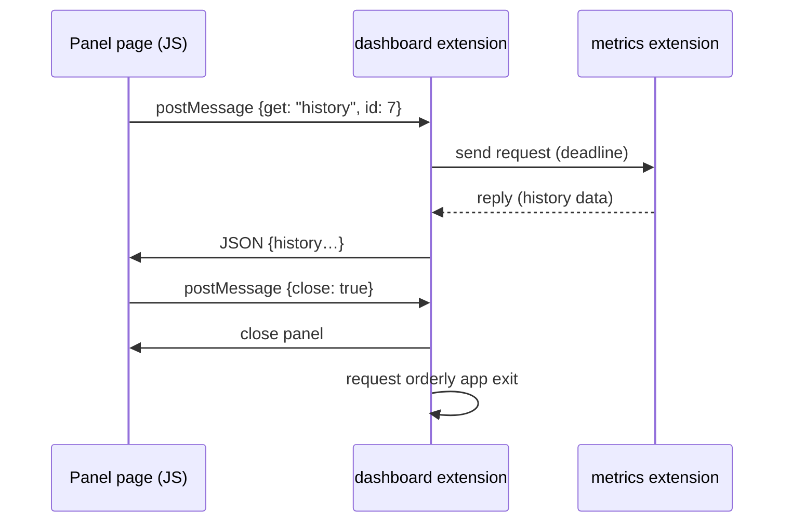

# Worked example: "dashboard" — a web panel extension

A status dashboard rendered as a web page: an HTML/JS frontend in a wry panel,
fed with data the extension gathers over the bus. Shows the `web/*` backend
end to end, including a direct request to another extension. The implementation
lives in `examples/dashboard` with its `examples/metrics` peer.

## Run it

```sh
pwsh examples/dashboard/build.ps1
```

Launch `examples/dashboard/dist/bones(.exe)`. The package contains the app
built with its `web` feature, `web = true` configuration, and both components.

## Setup

1. Manifest: name `dashboard`, version `0.1.0`. The extension package bundles
   its frontend assets (HTML/JS/CSS).
2. `init`: subscribe to `web/*` events for its panel and to the app-defined
   topic `metrics/updated`; directly send `web::Command::Open` to the `web`
   endpoint with the bundled page.

## Steady state

No tick subscription — the extension is fully event-driven and idle between
messages. Data flows in two patterns:

- **Push:** another extension publishes on `metrics/updated`; the dashboard
  forwards a JSON summary to its page.
- **Pull:** the page asks for details; the extension resolves it with a direct
  request to the owning extension.



The page never touches the bus directly: everything crosses through the
owning extension, which decides what its frontend may see and do
(presentation.md).

## Behavior under engine rules

- **Request outcome is total:** an unavailable peer or invalid peer reply is
  converted into explicit error JSON, so the page never receives a malformed
  pseudo-response.
- **Panel ownership:** if the dashboard extension unloads or faults, the core
  closes its panel automatically (presentation.md).
- **Optional feature:** on an engine built without the web feature, the
  direct open command returns `UnknownEndpoint` — this dashboard logs the
  failure instead of silently losing the request.
