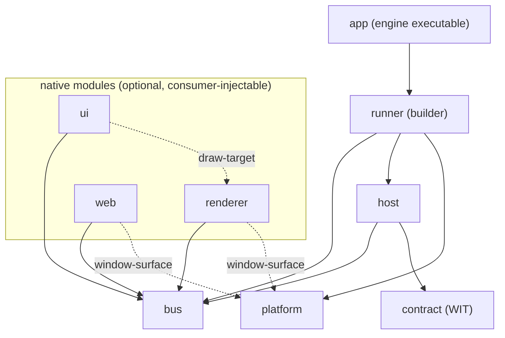

# Static structure

Component inventory, dependency rules, and source layout. Code-agnostic:
components are logical units — how they map to crates/modules may change
without touching this document.

Since [ADR-011](adr/ADR-011-native-core-modules.md) the core has two tiers:
a fixed **kernel** and optional, consumer-injectable **native modules**
(detailed in [design/modules.md](design/modules.md)).

## Kernel components

| Component | Responsibility                                                     | Depends on             |
| --------- | ------------------------------------------------------------------ | ---------------------- |
| bus       | Topics, direct request/reply, delivery semantics, budgets          | logging                |
| host      | Loads/instantiates extensions, dispatches handler calls, watchdog  | bus, contract, logging |
| contract  | The WIT package — the extension-facing API definition             | —                     |
| platform  | SDL window, tray, input sources, timing, event pump; headless mode | logging                |
| runner    | Frame-phase loop skeleton, module & service registries, builder API | bus, host, platform, logging |
| logging   | Structured sink, per-extension tagging, drop counters              | —                     |

## Native modules (first-party)

All feature-flagged and individually optional; embedders may add their own.

| Module   | Responsibility                                  | Uses (kernel + services)          |
| -------- | ----------------------------------------------- | --------------------------------- |
| renderer | Executes gfx batches, presents; provides `draw-target` | bus; `window-surface` service |
| ui       | egui integration: widget specs → draw data, events back | bus; `draw-target` service   |
| web      | wry panels, bus ↔ page JSON bridge             | bus; `window-surface` service     |

## Distributions

Both are first-class products; the app is the common case.

| Artifact | Content                                              | Audience                                    |
| -------- | ---------------------------------------------------- | ------------------------------------------- |
| app      | Engine executable: default modules via public builder | Most projects — write WASM extensions only |
| library  | Kernel + module crates + builder API                 | Embedders needing native modules (subrepo / git dep) |

## Dependency rules



- Solid arrows are crate dependencies; dashed arrows are **service traits**
  (defined by the kernel, listed in design/modules.md) — the consumer depends
  on the trait, not on the provider's crate.
- Anything not drawn is a design violation (e.g. bus depending on host,
  platform depending on renderer, module depending on another module's crate).
- **bus and contract know nothing about presentation** — messaging must stay
  usable in a headless build.
- **logging is a universal leaf**: anyone may depend on it (edges omitted
  above for readability); it depends on nothing.
- **Every module is optional**; the kernel must build and run with zero
  modules registered (headless configuration).
- **Nothing depends on app**, and app has no access embedders lack — it uses
  only the public builder API.
- Extensions depend only on **contract** — never on core internals.

## Source layout

```text
bones/
├── core/          # one directory per component above
│   ├── bus/       #
│   ├── host/      #
│   ├── platform/  #  kernel
│   ├── runner/    #
│   ├── logging/   #
│   ├── renderer/  #
│   ├── ui/        #  first-party native modules
│   ├── web/       #
│   └── app/       #  the engine executable (default composition)
├── wit/           # contract: the WIT package
└── extensions/    # first-party & example extensions, one directory each
```

How directories map to build units (workspace members, features) is an
implementation concern and may change freely as long as the component
boundaries and dependency rules above hold. Embedding bones in a parent
project is covered in [design/modules.md](design/modules.md).
