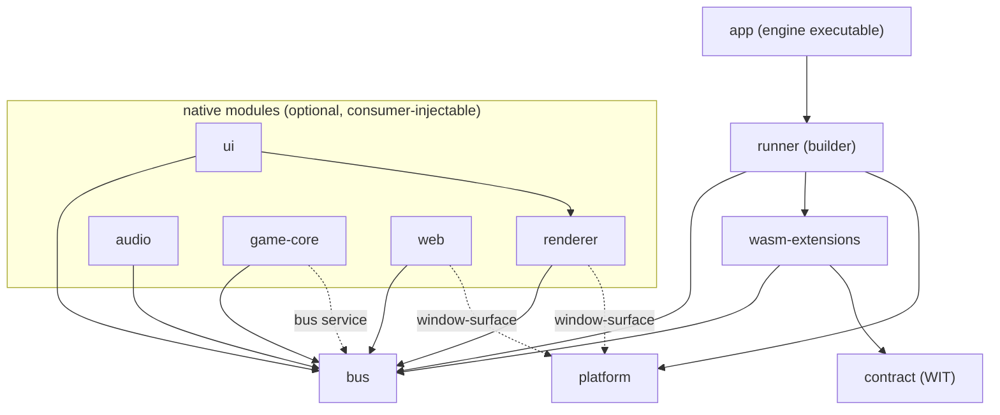

# Static structure

Component inventory, dependency rules, and source layout. Code-agnostic:
components are logical units — how they map to crates/modules may change
without touching this document.

Since [ADR-011](adr/ADR-011-native-core-modules.md) the core has two tiers:
a fixed **kernel** and optional, consumer-injectable **native modules**
(detailed in [design/modules.md](design/modules.md)).

Responsibilities in *italics* are not yet built — see
[roadmap.md](roadmap.md) for what's outstanding.

## Kernel components

| Component | Responsibility                                                     | Depends on             |
| --------- | ------------------------------------------------------------------ | ---------------------- |
| bus       | Topics, direct request/reply, delivery semantics, the `Module` contract and typed service registry (ADR-017); *queue budgets* | logging |
| wasm-extensions | Everything about a WASM extension's existence over time (ADR-020): loading/dispatch/watchdog (`host`), state-transition events (`lifecycle`), and save/load of its own state (`persistence`, unconditional — see the ADR for why it isn't in the optional module set below) | bus, contract, logging |
| contract  | The WIT package — the extension-facing API definition             | —                     |
| platform  | SDL window, tray, input sources, timing, event pump; headless mode | logging                |
| runner    | Frame-phase loop skeleton, builder API (`.module(...)` injection)  | bus, wasm-extensions, platform, logging |
| logging   | Structured sink, per-extension tagging; *drop counters*            | —                     |

## Native modules (first-party)

All feature-flagged and individually optional; embedders may add their own.

| Module   | Responsibility                                  | Uses (kernel + services)          |
| -------- | ----------------------------------------------- | --------------------------------- |
| renderer | Executes gfx batches, presents; provides `draw-target` | bus; `window-surface` service |
| ui       | egui integration: widget specs → draw data, events back | bus; renderer (direct-wired, not yet the `draw-target` service — see design/modules.md) |
| audio    | Plays sound effects and music via `audio/*`, backed by `kira` | bus |
| game-core | ECS/collision/tilemap/sprite-animation simulation via `game-core/*`, publishing `gfx/*`, backed by `hecs`/`glam`/`tiled` (ADR-019) and an internal backend-agnostic `PhysicsBackend` trait with `rapier2d` and retro/arcade implementations (ADR-021, ADR-022) | bus; `bus` service (to publish `gfx/*`, since it's injected via the generic `.module(...)` path, not renderer/ui's hardcoded sugar) |
| *web*    | *wry panels, bus ↔ page JSON bridge*            | *bus; `window-surface` service*   |

## Distributions

Both are first-class products; the app is the common case.

| Artifact | Content                                              | Audience                                    |
| -------- | ---------------------------------------------------- | ------------------------------------------- |
| app      | Engine executable: default modules via public builder | Most projects — write WASM extensions only |
| library  | Kernel + module crates + builder API                 | Embedders needing native modules (subrepo / git dep) |

## Dependency rules



- Solid arrows are crate dependencies; dashed arrows are **services**
  (typed values in the registry `bus::Module` defines, listed in design/
  modules.md) — the consumer depends on `bus`, not on the provider's crate.
- Anything not drawn is a design violation (e.g. bus depending on host,
  platform depending on renderer, module depending on another module's crate)
  — except `UI --> Renderer`, direct-wired the same way renderer itself is
  direct-wired into `Engine` rather than through a module trait; both are
  provisional until that trait exists (design/modules.md).
- **bus and contract know nothing about presentation** — messaging must stay
  usable in a headless build.
- **logging is a universal leaf**: anyone may depend on it (edges omitted
  above for readability); it depends on nothing.
- **Every module in the optional, consumer-composed set is optional**; the
  kernel must build and run with zero of them registered (headless
  configuration). `wasm-extensions::persistence` is `Module`-shaped but
  kernel-tier, not a member of that set — see ADR-020.
- **Nothing depends on app**, and app has no access embedders lack — it uses
  only the public builder API.
- Extensions depend only on **contract** — never on core internals.

## Source layout

```text
bones/
├── core/          # one directory per component above
│   ├── bus/       #
│   ├── wasm-extensions/ #  kernel: host + lifecycle + persistence (ADR-020)
│   ├── platform/  #  kernel
│   ├── runner/    #
│   ├── logging/   #
│   ├── renderer/  #
│   ├── ui/        #  first-party native modules
│   ├── audio/     #
│   ├── game-core/ #  ECS/physics/tiles/graphics, see docs/code-style.md
│   ├── web/       #  (planned)
│   └── app/       #  the engine executable (default composition)
├── wit/           # contract: the WIT package
├── shared/        # crates depended on by both host and WASM guest code
│   └── bones-messages/ # typed core messages + payload codecs (tick, gfx, ...)
├── vendor/        # tracked upstream dependencies (submodules)
│   └── pubsub-bus/   # the bus's underlying pub/sub primitive
├── extensions/    # first-party & example extensions, one directory each
└── embedding-demo/ # separate workspace proving .module(...) needs no privileged access
```

How directories map to build units (workspace members, features) is an
implementation concern and may change freely as long as the component
boundaries and dependency rules above hold. Embedding bones in a parent
project is covered in [design/modules.md](design/modules.md).
