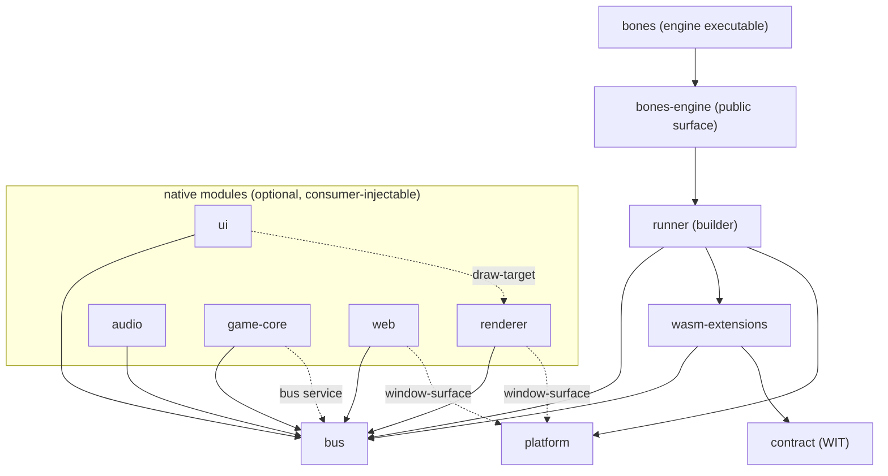

# Static structure

Component inventory, dependency rules, and source layout. Code-agnostic: components are logical units — how they map to crates/modules may change without touching this document.

Since [ADR-011](adr/ADR-011-native-core-modules.md) the core has two tiers: a fixed **kernel** and optional, consumer-injectable **native modules** (detailed in [design/modules.md](design/modules.md)).

Component names below are logical. The crates implementing them all carry a `bones-` prefix and are private behind `bones-engine`, the single public library surface ([ADR-030](adr/ADR-030-package-structure-follows-consumer-use-cases.md)).

## Kernel components

| Component | Responsibility | Depends on |
| --- | --- | --- |
| bus | Topics, direct request/reply, delivery semantics, the `Module` contract and typed service registry (ADR-017), queue budgets and drop counters | logging |
| wasm-extensions | Everything about a WASM extension's existence over time (ADR-020): loading/dispatch/watchdog (`host`), state-transition events (`lifecycle`), and save/load of its own state (`persistence`, unconditional — see the ADR for why it isn't in the optional module set below) | bus, contract, logging |
| contract | The WIT package — the extension-facing API definition | — |
| platform | SDL window, tray, input sources, timing, event pump; headless mode | logging |
| runner | Frame-phase loop skeleton, extension discovery and supervision — module-agnostic, so it sits in the kernel (ADR-031) | bus, wasm-extensions, logging |
| engine | The public surface plus the composition root: the builder API (`.module(...)` injection, and the `.renderer()`/`.ui()` sugar over it), and the one crate an embedder depends on | runner, bus, logging, messages; optional renderer/ui/audio/game-core/web |
| logging | Structured sink and per-extension tagging | — |

## Native modules (first-party)

All feature-flagged and individually optional; embedders may add their own.

| Module | Responsibility | Uses (kernel + services) |
| --- | --- | --- |
| renderer | Executes gfx batches, presents; provides `draw-target` | bus; `window-surface` service |
| ui | egui integration: widget specs → draw data, events back | bus; `draw-target` service |
| audio | Plays sound effects and music via `audio/*`, backed by `kira` | bus |
| game-core | ECS/collision/tilemap/sprite-animation simulation via `game-core/*`, publishing `gfx/*`, backed by `hecs`/`glam`/`tiled` (ADR-019) and an internal backend-agnostic `PhysicsBackend` trait with `rapier2d` and retro/arcade implementations (ADR-021, ADR-022) | bus; `bus` service (to publish `gfx/*`, since it's injected via the generic `.module(...)` path, not renderer/ui's hardcoded sugar) |
| web | wry panels, bus ↔ page JSON bridge | bus; `window-surface` service |

## Distributions

Both are first-class products; the app is the common case.

| Artifact | Content | Audience |
| --- | --- | --- |
| app | `bones`: the engine executable, default modules via the public builder, shipped with the ABI it implements | Most projects — write WASM extensions only |
| library | `bones-engine`: the curated builder and module API | Embedders needing native modules (subrepo / git dep) |
| Rust SDK | `bones-wasm-sdk`: the WIT, its generated bindings, and the message vocabulary | Extension authors writing Rust |
| ABI | `bones:extension` and the message wire format | Extension authors in any other language |

### How each one is obtained

**1.0 is a git-tag distribution, not a registry one.** Every package in this repository carries `publish = false`, and each manifest states why it cannot produce a self-contained archive: `bindgen!` and `generate!` read `wit/` from outside their own package roots, `pubsub-bus` is a submodule rather than a registry dependency, and the internal crates depend on each other by path with no versions. Adding versions alone would not fix it — the archives would still be missing the WIT they generate from. Publishing to crates.io stays open as a later 1.x decision; what it is not is a 1.0 promise made by omission.

A consumer therefore pins a tag:

```toml
[dependencies]
bones-engine = { git = "https://github.com/an-dr/bones", tag = "v1.0.0" }
```

```toml
# An extension author writing Rust, on the ABI line rather than the engine line.
bones-wasm-sdk = { git = "https://github.com/an-dr/bones", tag = "abi-v1.0.0" }
```

Both need `--recurse-submodules` on clone, since `vendor/pubsub-bus` is one.

What the tag promises:

- **The two version lines mean what ADR-029 says.** An engine tag moves when the Rust API changes; an ABI tag moves only when the guest contract does. They start equal at 1.0.0 (ADR-029) and are expected to diverge.
- **A tag is immutable.** Fixes arrive as a new tag, never by moving an old one, because a git dependency has no checksum a consumer can verify against.
- **`bones-engine` is the supported library surface.** Reaching past it into `bones-kernel` or a `bones-module-*` crate is possible in a git dependency in a way it would not be on a registry, and is not covered by the version line.
- **Support is best-effort on the platforms the release notes list.** See the root [README](../README.md) for which those are and how a release is produced.

## Dependency rules



- Solid arrows are crate dependencies; dashed arrows are **services** (typed values in the registry `bus::Module` defines, listed in design/ modules.md) — the consumer depends on `bus`, not on the provider's crate.
- Anything not drawn is a design violation (e.g. bus depending on host, platform depending on renderer, module depending on another module's crate). There are no exceptions: since [ADR-031](adr/ADR-031-native-modules-reach-each-other-only-through-services.md) no native module names another's crate, and `renderer`/`ui` reach the composition through the same `.module(...)` path an embedder uses.
- **bus and contract know nothing about presentation** — messaging must stay usable in a headless build.
- **logging is a universal leaf**: anyone may depend on it (edges omitted above for readability); it depends on nothing.
- **Every module in the optional, consumer-composed set is optional**; the kernel must build and run with zero of them registered (headless configuration). `wasm-extensions::persistence` is `Module`-shaped but kernel-tier, not a member of that set — see ADR-020.
- **Nothing depends on app**, and app has no access embedders lack. This is now a graph constraint rather than a convention: `bones` depends on `bones-engine` and nothing else among these crates.
- Extensions depend only on the **ABI** — `wit/` and the message vocabulary, reached through `bones-wasm-sdk` in Rust — never on core internals.

## Source layout

```text
bones/
├── crates/
│   ├── bones-engine/                  # the public surface embedders depend on; holds the composition root — the builder (ADR-030, ADR-031)
│   │   ├── bones-kernel/              #  bus, logging, contract, platform, wasm-extensions, runner: always-present and module-agnostic
│   │   ├── bones-module-renderer/     #  first-party native modules, each its own crate (ADR-030)
│   │   ├── bones-module-ui/           #
│   │   ├── bones-module-audio/        #
│   │   ├── bones-module-game-core/    #  ECS/physics/tiles/graphics, see docs/code-style.md
│   │   └── bones-module-web/          #  optional wry presentation module
│   ├── bones/                         #  the engine executable (default composition)
│   ├── bones-messages/                #  crate both host and WASM guest code depend on
│   ├── bones-wasm-sdk/                #  the Rust extension SDK, incl. the optional game_ui
│   └── bones-extension-hello/         #  the reference extension, the only one shipped
├── wit/                       # contract: the WIT package
├── vendor/                    # tracked upstream dependencies (submodules)
│   └── pubsub-bus/            #  the bus's underlying pub/sub primitive
└── examples/                  # runnable examples, incl. embedding-demo (see its README)
```

How crates map to build units (workspace members, features) is an implementation concern and may change freely as long as the component boundaries and dependency rules above hold. Embedding bones in a parent project is covered in [design/modules.md](design/modules.md).
