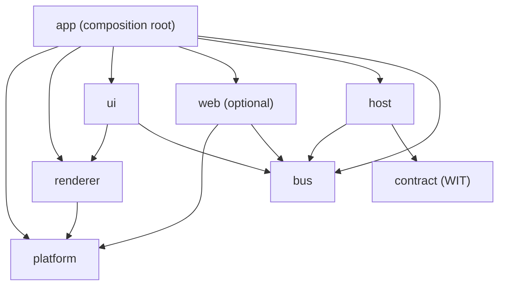

# Static structure

Component inventory, dependency rules, and source layout. Code-agnostic:
components are logical units — how they map to crates/modules may change
without touching this document.

## Components

| Component      | Responsibility                                                    | Depends on             |
| -------------- | ----------------------------------------------------------------- | ---------------------- |
| bus            | Topics, direct request/reply, delivery semantics, budgets         | logging                |
| host           | Loads/instantiates extensions, dispatches handler calls, watchdog | bus, contract, logging |
| contract       | The WIT package — the extension-facing API definition            | —                     |
| platform       | SDL window, tray, input sources, timing, event loop               | logging                |
| renderer       | Executes gfx batches, draws egui output, presents                 | platform, logging      |
| ui             | egui integration: widget specs → draw data, events back          | bus, renderer          |
| web (optional) | wry panels, bus ↔ page JSON bridge                               | bus, platform          |
| logging        | Structured sink, per-extension tagging, drop counters             | —                     |
| app            | Composition root: wires everything, owns the frame loop           | all of the above       |

## Dependency rules



- Arrows are the only allowed dependency directions; anything else (e.g. bus
  depending on host, platform depending on renderer) is a design violation.
- **bus and contract know nothing about presentation** — messaging must stay
  usable in a headless build.
- **logging is a universal leaf**: anyone may depend on it (edges omitted
  above for readability); it depends on nothing.
- **web is a build-time option**; no other component may require it.
- Extensions depend only on **contract** — never on core internals.

## Source layout

```text
bones/
├── core/          # the engine: one directory per component above
│   ├── bus/
│   ├── host/
│   ├── platform/
│   ├── renderer/
│   ├── ui/
│   ├── web/
│   ├── logging/
│   └── app/
├── wit/           # contract: the WIT package
└── extensions/    # first-party & example extensions, one directory each
```

How directories map to build units (workspace members, features) is an
implementation concern and may change freely as long as the component
boundaries and dependency rules above hold.
